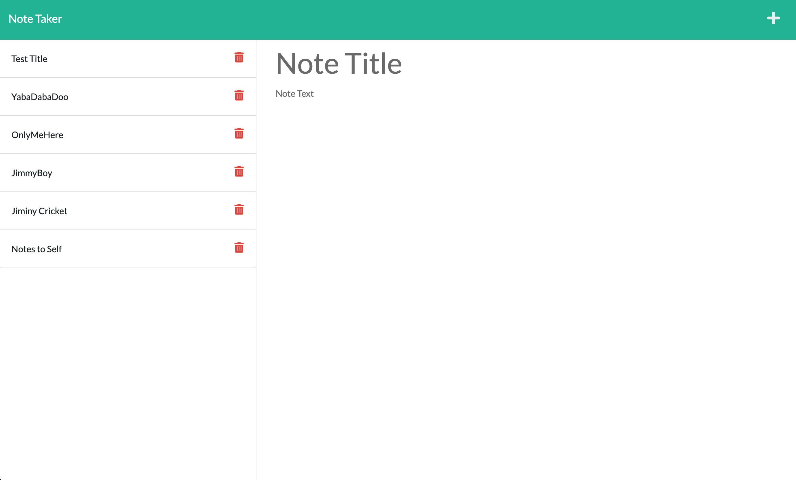

# note-a-maker

Notes to self made here using this handy little application.

## Description:

This application is intended to give the user a handy note taking tool. The note persist even when the application is closed allowing the user to access their reminders any time they choose.

## Technologies Used:

 * HTML
 * CSS
 * JavaScript
 * Node.js
 * Express.js
 * npm

 ## GIF of Site in Action:

 * (https://drive.google.com/file/d/18N5tqrYGk6ZOX9h8IJalQpShEozO9ah3/view)

 ## Screenshot of Site:

 

 ## Code Snippet:

